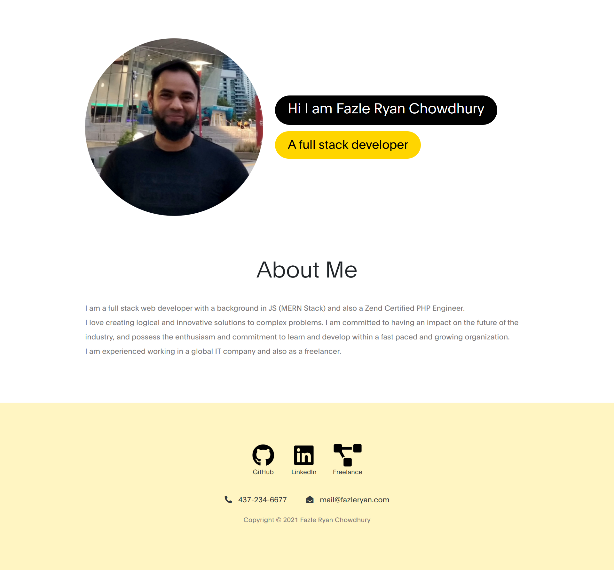

# react-portfolio

## Screenshot:

## USAGE:
- With react-portfolio, anyone will be able to see my a section about me, my portfolio with six projects, contact form to get back to me and a resume page.

## DESCRIPTION:
- When a user first opens react-portfolio in browser, he/she will be taken to about me page which contains my profile image, a friendly welcome note and and my title as a full stack developer at the top header section.
- Next user will see a short description about me. At the top there will be a navigation bar and at the bottom a footer containing link to my github profile, linkedin profile and my freelancer profile.
- When a user navigates to Portfolio, he/she will be presented with my 6 different projects images which shows the following when hovered over: 1) Project Title, 2)Link to the site, 3) Github repository 4)Focused Technology
- When a user navigates to Contact, then he/she will see a contact form and a small note of my phone number and email address. 
- When a user navigates to Resume, he/she will be presented with my technical skills and a downloadable link to my resume in .docx format.

## Site:
- Link to the site: https://ryan7998.github.io/react-portfolio/